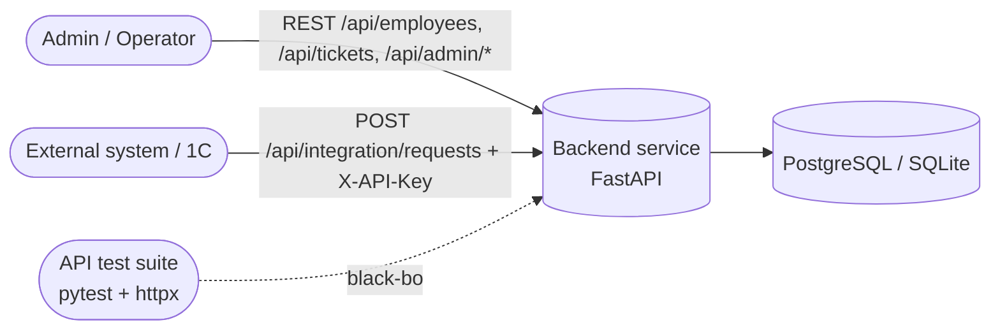
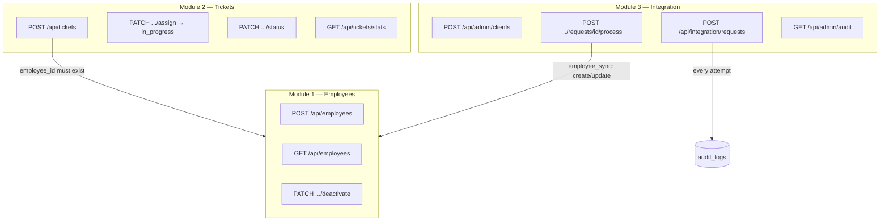
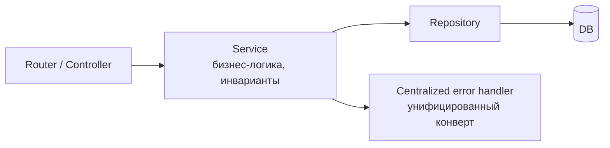
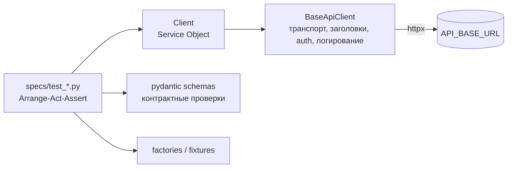

# SYSTEM_OVERVIEW

Высокоуровневый обзор системы. Детали — в [[FINAL_SYSTEM_SPEC]] и [[INVARIANTS]].

## Контекст

## Модули и потоки

## Слои (внутри сервиса)

## Тест-контур (POM для API)

Подробности слоёв тест-контура и матрица покрытия — в [[TEST_PLAN]] и `tests/README.md`.

---

*Graph: [[AGENT_CONTEXT]] · [[FINAL_SYSTEM_SPEC]] · [[INVARIANTS]] · [[TEST_PLAN]]*
